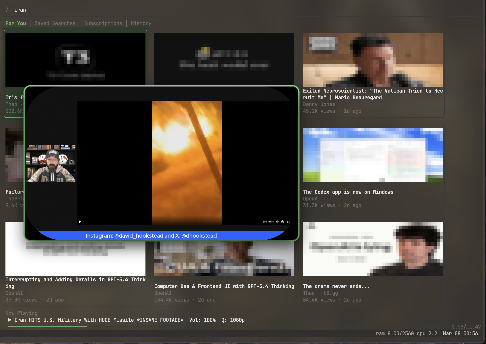

# youtube-terminal



A terminal-based YouTube client built with Rust. Browse videos, search
YouTube, manage subscriptions, and play content through mpv --
all from your terminal.

Built with [ratatui](https://ratatui.rs) for the TUI,
[mpv](https://mpv.io) for playback, and
[RustyPipe](https://codeberg.org/ThetaDev/rustypipe) for YouTube data.

## Prerequisites

- **Rust toolchain** (1.73+) -- install via [rustup](https://rustup.rs)
- **mpv** -- media player for video/audio playback
- **yt-dlp** -- used by mpv to resolve YouTube URLs

### Install prerequisites (macOS)

```sh
brew install mpv yt-dlp
```

### Install prerequisites (Linux)

```sh
# Debian/Ubuntu
sudo apt install mpv yt-dlp

# Arch
sudo pacman -S mpv yt-dlp
```

## Installation

```sh
cargo install --path .
```

Or build and run directly:

```sh
cargo run --release
```

## Key bindings

| Key                        | Action                    |
| -------------------------- | ------------------------- |
| `q` / `Ctrl+c`            | Quit or detach player     |
| `/` or `s`                 | Focus search              |
| `1` / `2` / `3` / `4`     | Switch tab (For You / Saved / Subs / History) |
| `S`                        | Save current search (in search view) |
| `d`                        | Delete saved search (in Saved tab) |
| `r`                        | Rename saved search (in Saved tab) |
| `h` `j` `k` `l` / arrows  | Navigate                  |
| `Enter`                    | Select                    |
| `Esc`                      | Back                      |
| `Space`                    | Toggle pause              |
| `<` / `>`                  | Seek -10s / +10s          |
| `+` / `=` / `-`            | Volume up / down          |
| `Q`                        | Toggle 720p / 1080p       |
| `X`                        | Stop player and quit      |
| `:`                        | Command mode              |

### Commands

| Command                    | Description               |
| -------------------------- | ------------------------- |
| `:q`                       | Quit or detach player     |
| `:stop-player`             | Stop detached player      |

## Saved Searches

Bookmark searches you run frequently so you can re-execute them with one
keystroke. Each saved search stores the query text **and** the active filters
(sort order, date range, type, length).

1. Search for something with `/`, optionally set filters with `f`.
2. Press `S` to save -- a popup asks for a name.
3. Switch to the **Saved Searches** tab (`2`) to see all your bookmarks.
4. Press `Enter` on any saved search to run it instantly with the original
   filters restored.
5. Use `r` to rename or `d` to delete a saved search.

The list shows which filters are active and when you last ran each search
(e.g. "ran 2h ago"), so you can tell at a glance which topics you haven't
checked recently.

## Playback Tuning

Long YouTube videos use explicit `mpv` buffering defaults now. If you want to
override them, create `~/.config/youtube-terminal/config.toml` and set any of:

```toml
mpv_cache_secs = 45
mpv_cache_pause_wait = 1.5
mpv_hwdec = "auto-safe"
mpv_force_seekable = true
mpv_demuxer_max_bytes = "128MiB"
mpv_demuxer_max_back_bytes = "64MiB"
default_playback_quality = "1080p"
```

Use `Q` in the app to flip between the built-in 720p and 1080p presets. If a
machine still struggles with long podcasts, set `default_playback_quality` to
`"720p"` so playback starts lower by default. The app also writes an `mpv` log
to `~/.config/youtube-terminal/cache/logs/mpv.log` for playback debugging.

## Detached Playback

When a video is playing, quitting the TUI detaches from `mpv` instead of
stopping playback. This is intended for popup workflows like `tmux popup`: pick
something, press `q`, and the video keeps running after the popup closes.

On the next launch, youtube-terminal restores the previous terminal view and
tries to reconnect to the still-running player session automatically. Use `X`
or `:stop-player` when you want to stop the detached player explicitly.

The last `mpv` window size and position are also reused when you switch videos
or relaunch the app, so the player stays where you left it instead of jumping
back to the default geometry each time.

## License

GPL-3.0-or-later
